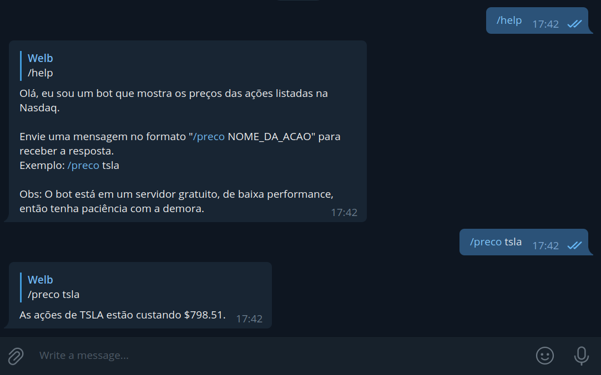

# Apresentação

Bot de Telegram que informa o preço de ações.
Nome do bot: @welb_stock_bot



# Instalação

1. Crie um ambiente virtual (recomendado):

```sh
	python3 -m venv .venv
	source .venv/bin/activate
```

2. Instale as dependências:

```sh
	pip install -r requirements.txt
```

3. Crie um arquivo .env com as seguintes variáveis:

```sh
    TELEGRAM_TOKEN=XXXXXXX
    RAPID_API_TOKEN=XXXXXXX
```

_Obs: Você deve criar uma conta no [RapidAPI](https://rapidapi.com/), e criar um bot do Telegram com o [BotFather](https://t.me/botfather) para ter os tokens._

4. Inicie o bot:

```sh
    python bot.py
```
